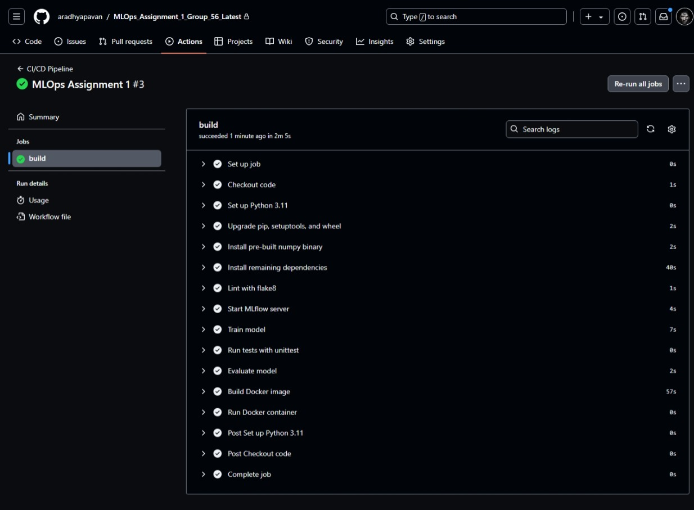
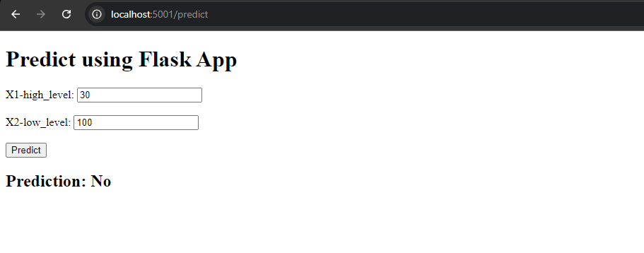

---

# MLOps Assignment 1 - Group 56

## Overview

This repository contains the MLOps Assignment 1 for Group 56. The goal of this assignment is to implement a CI/CD pipeline using GitHub Actions for a machine learning project that includes data preprocessing, model training, evaluation, and deployment in a Docker container.

## Project Structure

- **`app.py`**: Flask application that serves predictions from the trained model.
- **`data_preprocessing.py`**: Script for preprocessing the liver disease dataset, including handling missing values, normalizing features, and removing outliers.
- **`train_model.py`**: Script for training the machine learning model using the preprocessed data and tracking the model using MLflow.
- **`evaluate_model.py`**: Script for evaluating the trained model and logging the evaluation metrics using MLflow.
- **`Dockerfile`**: Instructions to build the Docker image for the Flask application.
- **`requirements.txt`**: List of Python dependencies required to run the project.
- **`.github/workflows/ci-cd.yml`**: GitHub Actions workflow file that defines the CI/CD pipeline. You can view it [here](https://github.com/aradhyapavan/MLOps_Assignment_1_Group_56_Latest/blob/main/.github/workflows/ci-cd.yml).
- **`sampledatasets/`**: Contains the dataset used for the project (`liver_disease_1.csv`).
- **`templates/`**: HTML templates for the Flask application (`index.html`).
- **`models/`**: Directory containing the trained model (`model.joblib`).
- **`mlruns/`**: Directory used by MLflow to store experiment runs.
- **`train_output/`**: Directory where training data outputs (`X_train.csv`, `Y_train.csv`) are stored.
- **`test_output/`**: Directory where test data outputs (`X_test.csv`, `Y_test.csv`) are stored.
- **`output/`**: Directory where final model predictions are stored (`final_predicted_output.csv`).
- **`final_output/`**: Another directory for storing final output files.

## Setup Instructions

### Prerequisites

- Python 3.11 or later
- Docker
- GitHub Actions configured in your repository

### Installation

1. Clone the repository:
   ```bash
   git clone https://github.com/aradhyapavan/MLOps_Assignment_1_Group_56_Latest.git
   cd MLOps_Assignment_1_Group_56_Latest
   ```

2. Install the required Python packages:
   ```bash
   pip install -r requirements.txt
   ```

3. Run the data preprocessing script:
   ```bash
   python data_preprocessing.py
   ```

4. Train the model:
   ```bash
   python train_model.py
   ```

5. Evaluate the model:
   ```bash
   python evaluate_model.py
   ```

### Running the Flask Application

1. Build the Docker image:
   ```bash
   docker build -t my_flask_app:latest .
   ```

2. Run the Docker container:
   ```bash
   docker run -d -p 5001:5001 my_flask_app:latest
   ```

3. The Flask application will be accessible at `http://127.0.0.1:5001/`.

## CI/CD Pipeline

The CI/CD pipeline is configured using GitHub Actions. The workflow is defined in the `.github/workflows/ci-cd.yml` file. The pipeline performs the following steps:

1. **Checkout code**: Clones the repository.
2. **Set up Python 3.11**: Configures the Python environment.
3. **Upgrade pip, setuptools, and wheel**: Ensures the latest versions of these tools are installed.
4. **Install dependencies**: Installs the required Python packages.
5. **Lint with flake8**: Checks the code for style and formatting issues.
6. **Start MLflow server**: Starts the MLflow server for tracking experiments.
7. **Train model**: Trains the model and logs the experiment with MLflow.
8. **Run tests with unittest**: Runs the unit tests to ensure code quality.
9. **Evaluate model**: Evaluates the trained model and logs the results with MLflow.
10. **Build Docker image**: Creates a Docker image of the Flask application.
11. **Run Docker container**: Deploys the Flask application in a Docker container.

## Screenshots

### GitHub Actions Workflow


### Flask Application


---
